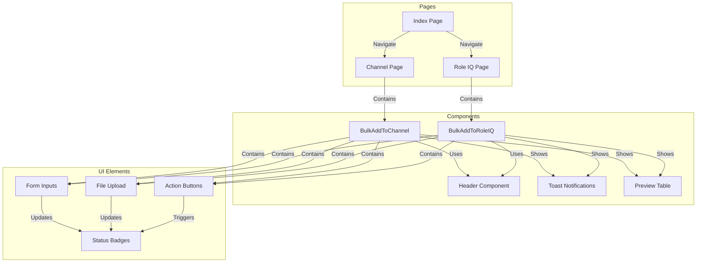
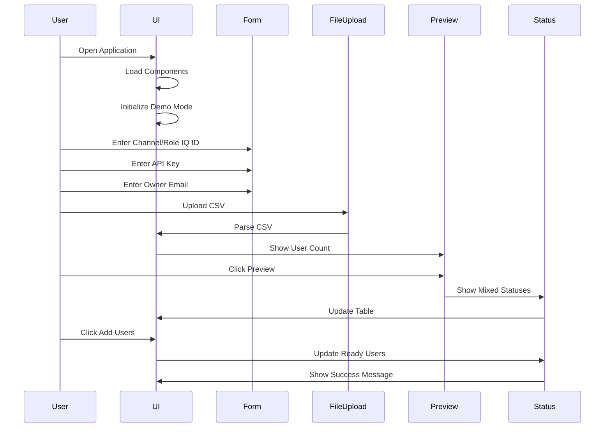
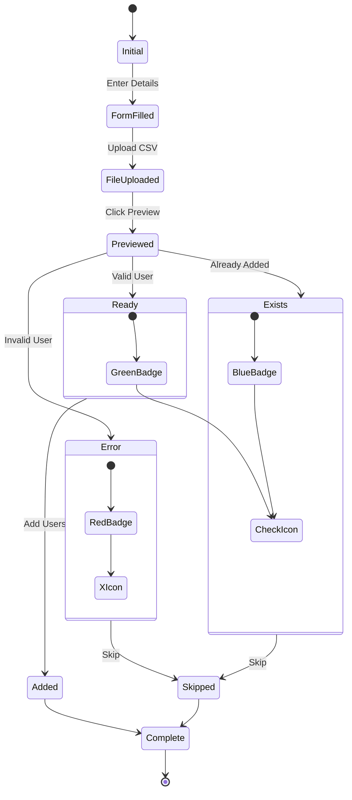
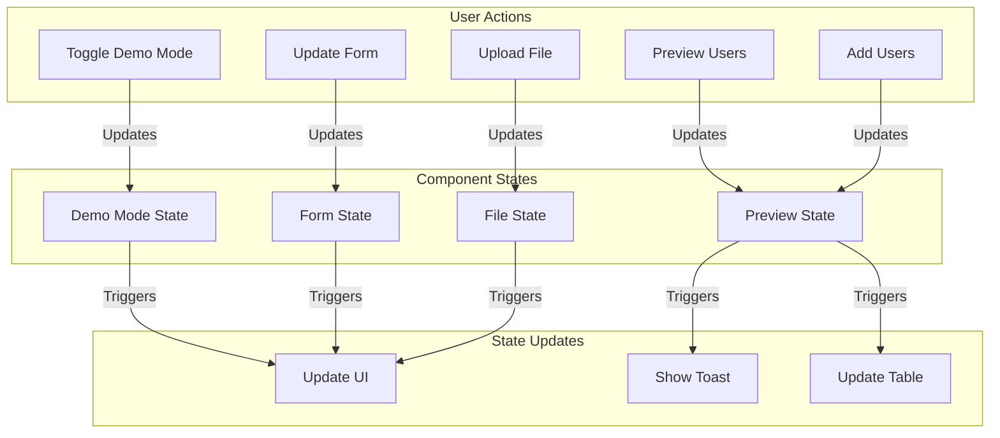

# Pluralsight User Automator Frontend Flow

## Component Interaction Flow

## User Interaction Flow

## Status Management Flow

## Component State Management

## UI Element States

1. **Form Inputs**
   - Empty State
   - Filled State
   - Error State
   - Valid State

2. **File Upload**
   - No File
   - File Selected
   - Processing
   - Complete

3. **Status Badges**
   - Ready (Green)
   - Error (Red)
   - Exists (Blue)

4. **Action Buttons**
   - Disabled
   - Enabled
   - Loading
   - Complete

## Demo Mode States

1. **Initial State**
   - Empty form
   - No file
   - Disabled buttons

2. **Demo Enabled**
   - Pre-filled form
   - Demo file
   - Enabled buttons

3. **Preview State**
   - Mixed statuses
   - Color-coded badges
   - Status messages

4. **Complete State**
   - Updated statuses
   - Success message
   - Reset option 