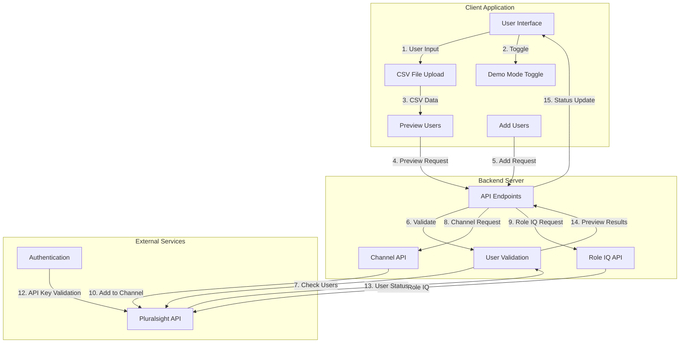
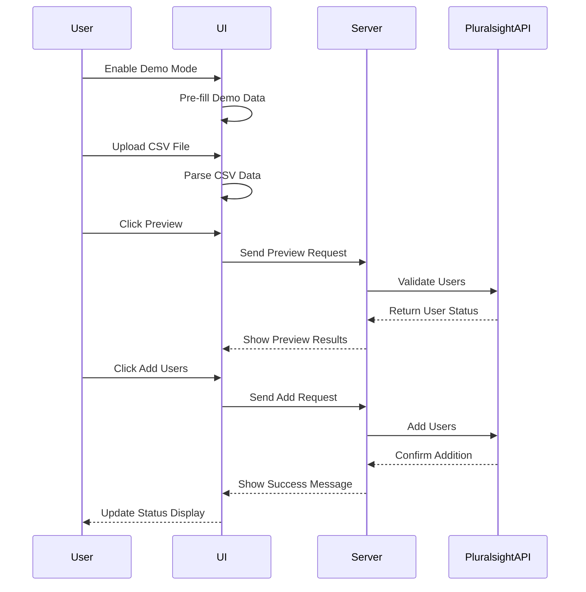
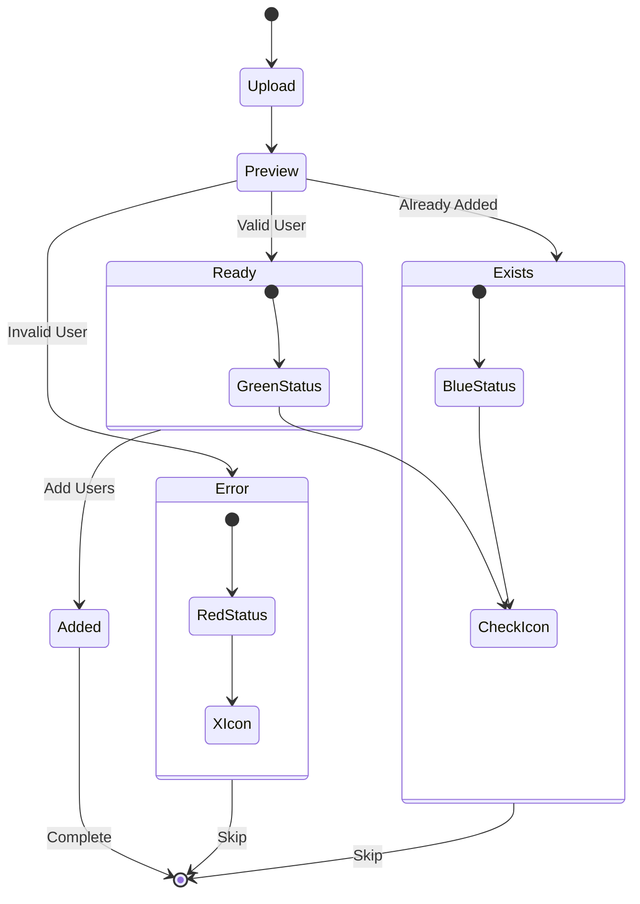
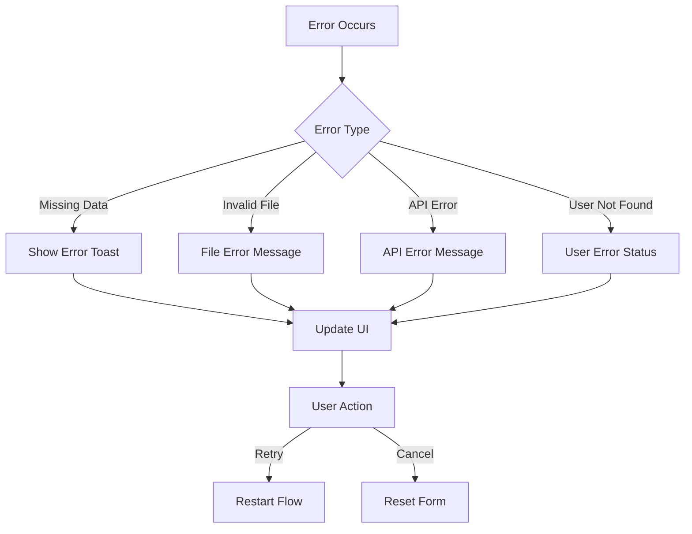

# Pluralsight User Automator Integration Flow

## System Architecture Flow

## Data Flow Sequence

## Status Flow Diagram

## Integration Points

1. **Client-Server Communication**
   - REST API endpoints
   - JSON data format
   - Error handling and status codes

2. **Pluralsight API Integration**
   - Authentication via API Key
   - User validation endpoints
   - Channel management endpoints
   - Role IQ management endpoints

3. **Data Processing**
   - CSV file parsing
   - Email validation
   - Status tracking
   - Error handling

4. **Demo Mode Integration**
   - Local data simulation
   - Status simulation
   - Response simulation

## Error Handling Flow

